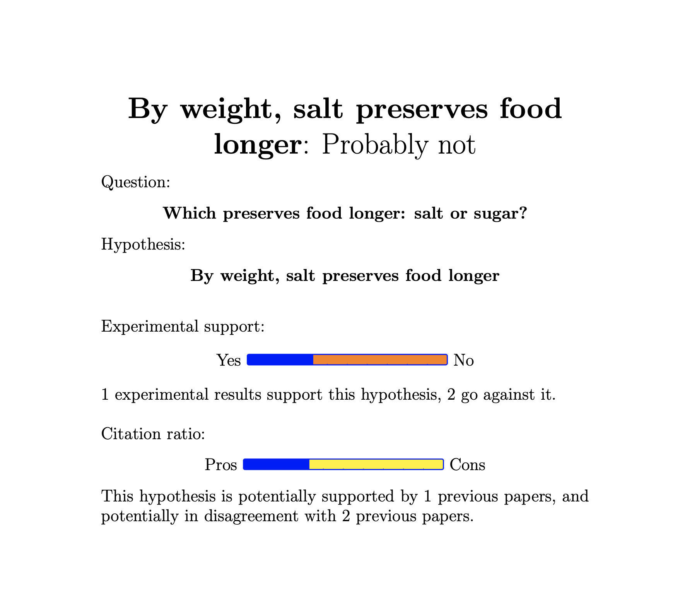

# SciHealthCheck
A latex package to do a sanity check on your hypothesis-driven scientific papers. Generates a simplifed title, a summary and stats.

Overleaf: https://www.overleaf.com/read/ghhrqhwnnmvh

## How to use

Copy the Overleaf project, or upload scihealthcheck.sty in your latex folder.
Add `\usepackage{scihealthcheck}` to your main.tex file.

## Commands

These commands help you make sure you have a research question and a hypothesis written in plain text somewhere in your file (ideally in the abstract or introduction!)
Just put them around wherever that text is.

`\question{your question here}`

`\hypothesis{your hypothesis here}`

These commands help you summarise some statistics about your paper:

`\hcite{pro}{_citePaper_}` and `\hcite{con}{_citePaper_}` , to mark which papers in the literature are supporting your argument or going against it.

`\result{pro}` and `\result{con}`, to mark which of your experimental analyses support your hypothesis.
